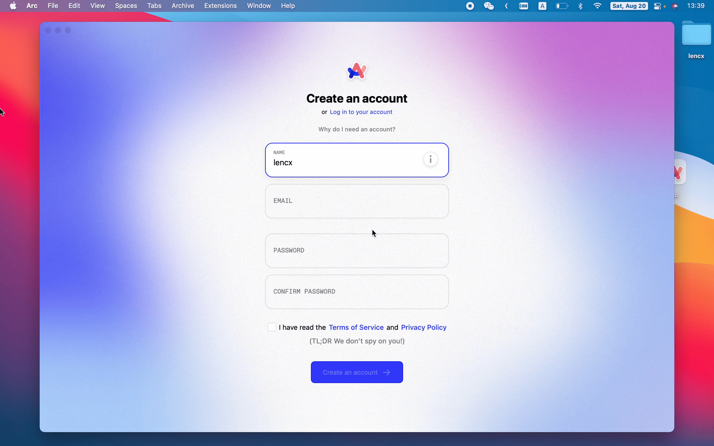
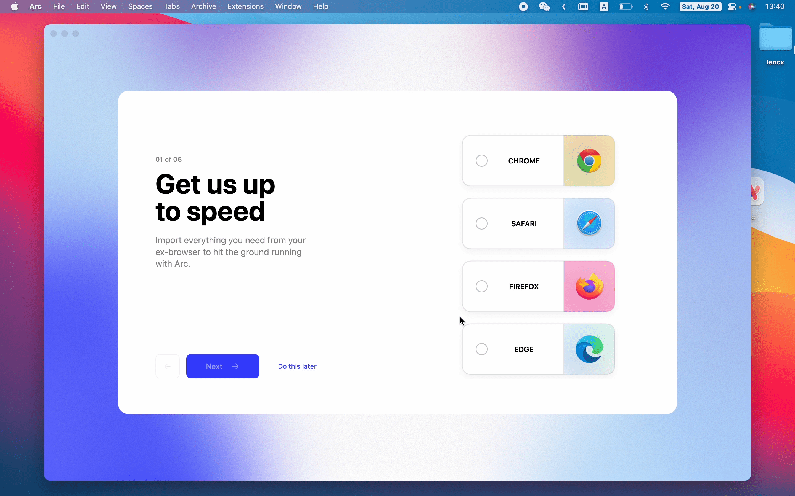
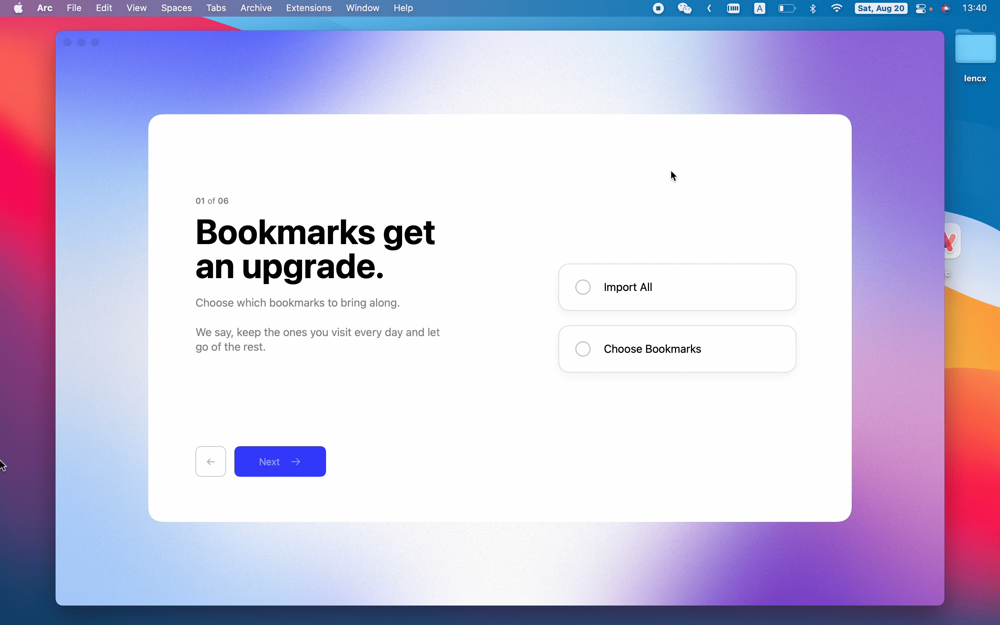
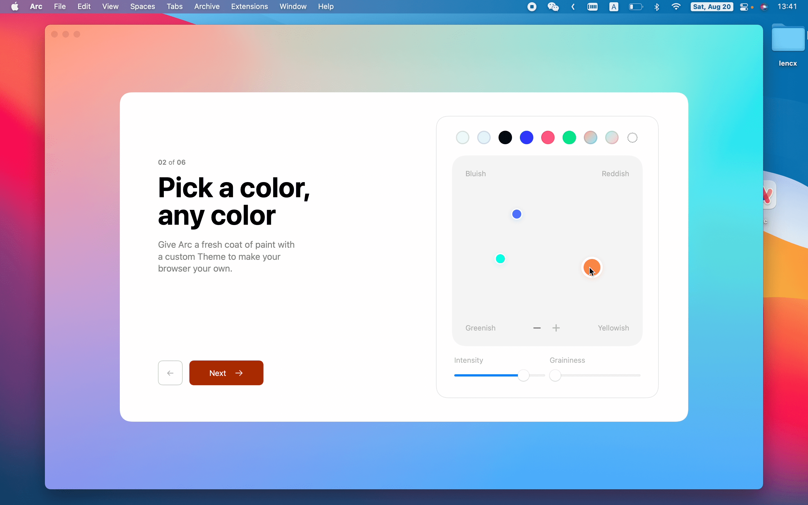
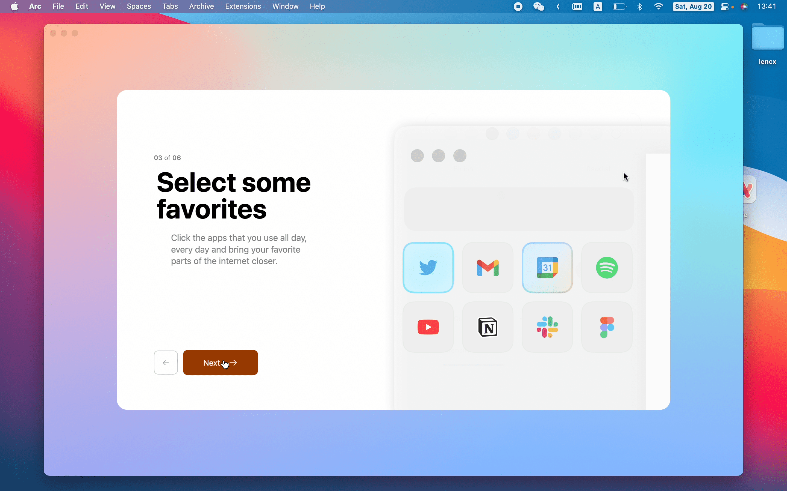
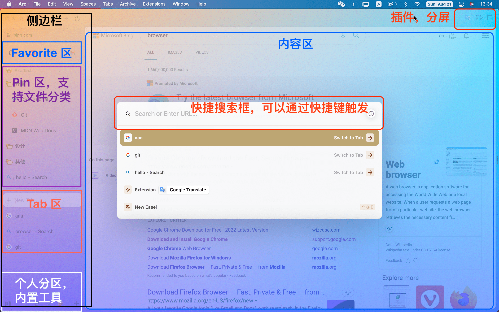
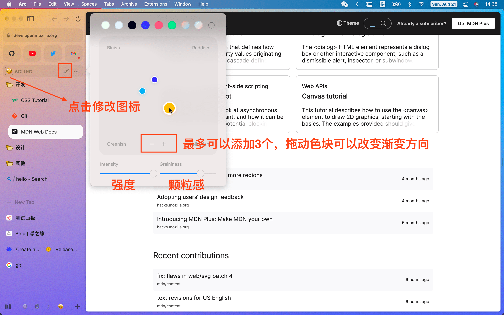
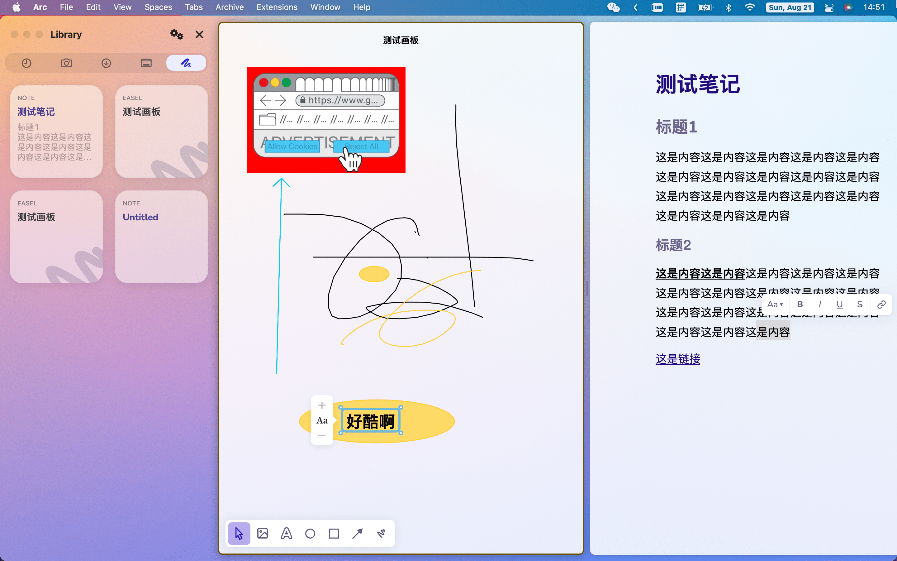
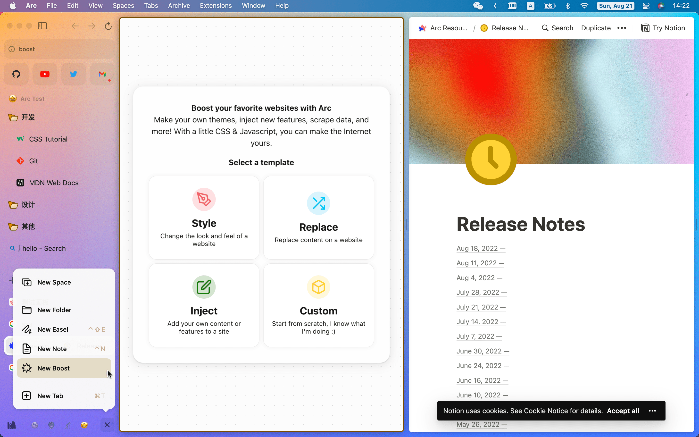

## 背景

> [Arc Browser Company](https://thebrowser.company/) ，正在构建一种更好的互联网使用方式

当我们想到浏览互联网时，往往会忽略浏览器本身。相反，我们想到的是我们在网上做的所有事情（如阅读文章，收发电子邮件，观看节目等等）。而实现这一切的软件，即浏览器，是如此的普遍，以至于它被忽略了。

尽管我们的互联网使用方式已经发生了变化，但浏览器却一直保持着相对不变。当我们所有的其他软件工具都在向更好的方向发展时（具有更多的协作特性、灵活的界面和强大的功能），浏览器在很大程度上仍然保持着 25 年前的状态（URL 栏 + TAB）。

更重要的是，我们往往将浏览器的缺陷归咎于自己。当我们的浏览器有太多的标签时，会说自己效率低下；当我们在网上分心时，会告诉自己需要更多的约束；当我们找不到一个网址时，会认为自己是无组织的。造就这一切的浏览器难道就没有一点责任吗？

这就是为什么我们要建立一个新的浏览器，我们称之为 **Arc**，因为我们相信浏览器可以做得更多，以增强我们的能力。我们正在想象一个能够像我们一样快速思考的浏览器，为我们分担工作，并将我们的创造力向前推进。一个为我们在 2022 年使用互联网的方式所配备的浏览器，也是我们希望在未来使用互联网的基础（Arc 更像是一种轻量级的在线操作系统，应用程序则是 URL）。

[A Startup Wants to Rescue You From Browser Tab Hell](https://www.bloomberg.com/news/features/2022-05-27/google-chrome-and-apple-safari-challenged-by-browser-upstart)

## 下载安装

<!-- > 目前 `Arc` 并未开放下载，需要进行预约，关注公众号，发送 `arc` 获取预约链接。 -->

- 安装完成，打开后创建 Arc 账号

  

- 选择导入浏览器数据到 Arc（Chrome，Safari，Firefox，Edge）

  

- 将浏览器下的书签导入到 Arc

  

- 设置浏览器主题色（可以使用默认，在 Arc 设置中可以随时修改）

  

- 设置高频使用的网址（可以使用默认，进入 Arc 后可以随时修改）

  

## Arc 初识

- 侧边栏
  - URL 栏（输入 URL 或关键词搜索）
  - Favorite 区（高频使用。支持拖拽）
  - Pin 区（经常使用，可以创建文件夹，分类进行管理。支持拖拽）
  - Tab 区（浏览器标签页，和常规浏览器类似，但在标签后多了一些操作选项，如复制链接，设置图标，Pin，重命名等。支持拖拽）
  - 底部包含 Library 及个人空间管理
    - Library 是可配置的，用于展示系统文件（如浏览截图，文档，桌面文件等），还支持创建笔记，画板。
    - 工作区管理包含创建，删除，排序，切换及设置（图标，主题）等
    - `New Boost`  功能（包含样式修改，内容替换，脚本注入等，注意此操作属于危险操作，可能会导致网页显示错误，请谨慎使用）
- 插件 & 分屏区
  - 兼容 Chrome 体系下的插件
  - 分屏可以创建多窗口来进行多任务处理
- 全局搜索框（可以通过快捷键触发）
- 内容区

## Arc 总结

从 Arc 关于可以看到 `Version 0.64.0 (34177)` 是基于 `Chromium Engine Version 104.0.5112.102` 改造而来，走了类似于 [Microsoft Edge](https://www.microsoft.com/en-us/edge) 的路子，不同的是 Edge 只是对其进行局部优化，未改变浏览器核心交互方式，及操作习惯。而 Arc 则不然，大刀阔斧，主要包含以下方面（从我短暂的使用来看，欢迎补充）：

- 使用精心设计的侧边栏布局，极大程度释放了屏幕空间（支持固定，隐藏多种设置）
- 经常访问的网址可以有多种保存方式（如 Favorite，Pin 等）
- 多个人空间（可以按照个人习惯，将工作学习，生活娱乐完全隔离开来），而且每个空间可以定制个性化皮肤。
- 适合多任务处理的分屏浏览（一边查资料，一边记笔记）
- 内置小工具（如笔记，简易画板等）
- Library 可以通过系统授权，将文件系统交由 Arc 来管理（更加专注，不需要频繁在系统文件和浏览器之前反复横跳）
- 使用 `Chromium Engine` 的好处，是兼容了 Chrome 的插件生态，对严重依赖插件的用户来说，这个显得格外重要。
- 针对专业人士开放的 `New Boost` 高级自定义功能（满足更多定制化需要）

