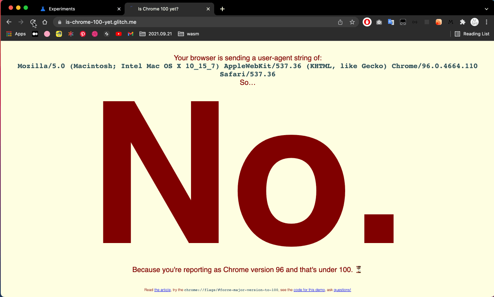
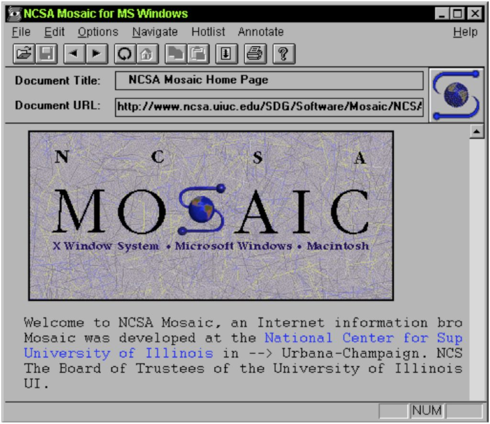

> 计算机世界是对现实世界的映射。当事物变得无法理解时，去源头找找，或许就明白了。

## Chrome 100

在 2022 上半年，[Chrome](https://www.google.com/intl/en_us/chrome/) 将达到三位数的主版本号：`100`！浏览器在很久以前第一次达到版本 `10` 时，因为主要版本号从一位数变为两位数，用户代理解析库发现了许多问题（[Changes in Opera’s user agent string format](https://maqentaer.com/devopera-static-backup/http/dev.opera.com/articles/view/opera-ua-string-changes/index.html)）。现在在 Chrome 和 [Firefox](https://www.mozilla.org/en-US/firefox/new/) 中都接近版本 `100`，[Edge](https://www.microsoft.com/en-us/edge) 也不甘落后。当 Chrome 达到 `100` 版，将会导致一些网站不工作。谷歌已经开始调查和测试解决方案。

根据 [Chromium Bug Tracker](https://bugs.chromium.org/p/chromium/issues/detail?id=1273958) ，已知受到影响的网站主要是使用网页设计工具 [Duda](https://www.duda.co/) 开发的网站。这些网站都使用相同的代码来检查用户使用的 Chrome 版本。

### 案例

以 Chrome 为例，用户代理字符串为 `Mozilla/5.0 (Macintosh; Intel Mac OS X 10_15_7) AppleWebKit/537.36 (KHTML, like Gecko) Chrome/96.0.4664.110 Safari/537.36`

字符串最后，可以看到我们要寻找的是 `Chrome/96.0.4664.110`，它为我们提供了浏览器的准确版本号。但是，大多数 Web 开发人员可能只关心主要版本号，即 `96`。

由于用户代理字符串是文本，开发人员需要自行提取信息以满足业务需求。对于 Duda，开发人员选择只读取 `Chrome/` 之后的前两位数字。这意味着 `Chrome/99` 将是 `99`， `Chrome/100` 将被视为版本 `10`。

而 Duda（2015 年发布的版本）会自动阻止低于 `Chrome 40` 的版本，`Chrome 99` 之后的每个版本（100 - 109）的浏览器都将被视为版本 `10`，因此被阻止。

目前 Duda 已经修复了此问题（[Chrome 100 Bug Was Fixed Months Before The New Version's Actual Release](https://blog.duda.co/chrome-100-bug-was-fixed-months-before-the-new-version-s-actual-release)）

### 检测与反馈

通过访问 [Is Chrome 100 yet?](https://is-chrome-100-yet.glitch.me/) 可以检查浏览器是否在 `User-Agent` 字符串中发送主要版本 100。

为了尽早检测三位数版本号可能导致的问题，在它成为现实前做好准备。我们可以在 Chrome 设置中开启 `User-Agent` 为 `100` 的主版本（[Force Chrome major version to 100 in the User-Agent string](https://developer.chrome.com/blog/force-major-version-to-100/)）来对网站进行测试。

1. 访问 `Is Chrome 100 yet?`，页面返回 `Yes!` 或 `No.`；
2. 打开 Chrome 浏览器并在地址栏中输入 `chrome://flags`；
3. 将打开一个包含可用实验的页面， 找到 `User-Agent` 中启用强制主要版本为 `100` 的选项（`Force major version to 100 in User-Agent`）。然后重新访问步骤 1。

成功开启后，然后测试自己的网站。如果发现问题，可以将错误报告发送至 [Web Compat](https://webcompat.com/issues/new?label=version100) 以帮助 Web 浏览器准备三位数的主版本号！

## 里程碑

[Web 浏览器简史](https://www.mozilla.org/zh-CN/firefox/browsers/browser-history/) - 世界历史从不缺少史诗般的权力斗争，有征服世界的暴君，也有落败的勇士。Web 浏览器的历史也大抵如此。学术先驱们编写出引发信息革命的简易软件，并为浏览器的优势和互联网用户而战。

在[《万维网 25 岁生日快乐》](https://computerhistory.org/blog/happy-25th-birthday-to-the-world-wide-web/)中可以了解更多网络诞生的相关信息。

### Mosaic

[Mosaic User Agents](https://developers.whatismybrowser.com/useragents/explore/software_name/mosaic/) - `NCSA_Mosaic/2.0 (Windows 3.1)`

[NCSA Mosaic](https://zh.wikipedia.org/wiki/Mosaic)，是一个早期普及的网页浏览器，也是互联网协议如 FTP、NNTP 和 Gopher 的客户端，浏览器因支持多种互联网协议而命名。其直观的接口、可靠性和简易安装，因此在当时大受欢迎，也是第一个可以在文字中嵌入图片，而不是在单独的窗口中显示图片的浏览器。

Mosaic 是引发 1990 年代互联网泡沫的网页浏览器。1992 年 11 月，世界上只有仅仅 26 个网站，每一个网站都受人注目。1993 年，Mosaic 推出了一个叫做 `What’s New` ([What's New With NCSA Mosaic](https://www.w3.org/MarkUp/html-test/ncsa/whats-new.html)) 的页面，几乎每天都会提供给大家一个全新网站的链接。这段期间，互联网的使用率正在由学术界和大型工业研究机构之外迅速普及。然而，这正是 Mosaic 浏览器的易用性推动了网络爆发性的成长，到了 1995 年 8 月，网站数量已经超过了一万个，1998年达到了数百万个网站数量。

### Mozilla

[Firefox User Agents](https://www.whatismybrowser.com/guides/the-latest-user-agent/firefox) - `Mozilla/5.0 (Macintosh; Intel Mac OS X 10.15; rv:95.0) Gecko/20100101 Firefox/95.0`

[Mozilla](https://zh.wikipedia.org/wiki/Mozilla) 是一个自由软件社群，由网景通信公司的成员于 1998 年创立。在非正式的场合下，“Mozilla” 这个名字常用于不同的事物上。这些事物大都与现已歇业的网景通信公司及其旗下的应用软件相关。

最初，“Mozilla” 被用作 [网景导航者（Netscape Navigator）](https://zh.wikipedia.org/wiki/%E7%BD%91%E6%99%AF%E5%AF%BC%E8%88%AA%E8%80%85) 的开发代号。网景通信公司希望“网景导航者”能够取代当时世界第一的 Mosaic，而这个名字由 “Mosaic Killa”（Killa 是俚语中 Killer 的拼法）变化而来，并与经典的虚拟怪物哥斯拉谐趣：“Godzilla eat the Mosaic”，即 `Mosaic + Godzilla + Killa = Mozilla`，Netscape 工程师杰米·加文斯基说他是在一次 Netscape 员工会议上想到这个名字的。

[Mozilla Firefox](https://zh.wikipedia.org/wiki/Firefox%E7%80%8F%E8%A6%BD%E5%99%A8)，通称 Firefox，中文也通称“火狐”，是一个自由及开源的网页浏览器，由 Mozilla 基金会及其子公司 Mozilla 公司开发。Firefox 于 2002 年由 Mozilla 社群成员创建，当时叫做“Phoenix”。Firefox 于 2004 年 11 月首次发布，并且 9 个月内下载量超过 6,000 万，获取了巨大的成功，Internet Explorer的主导地位首次受到了挑。其被认为是 `Netscape Navigator` 的精神续作。

<!-- https://user-images.githubusercontent.com/16164244/148161664-6c99b244-0dad-47cd-aff5-762d09e57357.png -->

### Internet Explorer

[Internet Explorer User Agents](https://developers.whatismybrowser.com/useragents/explore/software_name/internet-explorer/) - `Mozilla/4.0 (compatible; MSIE 6.0; Windows NT 5.1)`

[Internet Explorer](https://zh.wikipedia.org/wiki/Internet_Explorer)（旧称 Microsoft Internet Explorer 和 Windows Internet Explorer，简称 IE 或 MSIE），是微软所开发的图形用户界面网页浏览器。自从 1995 年开始，内置在各个新版本的 Windows 操作系统，也是微软 Windows 操作系统的一个组成部分。

Internet Explorer 曾是使用最广泛的网页浏览器，在 2002 年和 2003 年达到 95% 的使用率高峰。微软以捆绑方式赢得与 Netscape 的第一次浏览器大战，Netscape 是 1990 年代的主流浏览器。

Internet Explorer 计划由托马斯·里尔登开始于 1994 年夏天，当时 Netscape Navigator 占据浏览器市场份额 70% 以上。竞争对手苹果公司的 Mac OS 更使用 Netscape 作为默认的浏览器，但当时的 Windows 没有一个默认的浏览器。微软需要有一个自己的浏览器，但它没有时间从零开始创造一个浏览器。因此和 Spyglass 合作，Internet Explorer 从早期一款商业性的专利网络浏览器 Spyglass Mosaic 派生出来。

### Opera

[Opera User Agent](https://www.whatismybrowser.com/guides/the-latest-user-agent/opera) - `Mozilla/5.0 (Macintosh; Intel Mac OS X 10_15_7) AppleWebKit/537.36 (KHTML, like Gecko) Chrome/96.0.4664.110 Safari/537.36 OPR/82.0.4227.43`

Opera 是由 Opera 软件为个人电脑推出的网页浏览器，用于 Microsoft Windows、macOS 和 Linux 操作系统。

1996 年首次公开发布 Opera 2.0 版本，但仅在 Microsoft Windows 上运行。1998 年开始开发第一款用于移动设备平台浏览器。

Opera 在 2013 年以后采用 [Blink](https://zh.wikipedia.org/wiki/Blink) [排版引擎 （layout engine）](https://zh.wikipedia.org/wiki/%E6%B5%8F%E8%A7%88%E5%99%A8%E5%BC%95%E6%93%8E)。此前 Opera 版本曾采用 [Presto](https://zh.wikipedia.org/wiki/Presto) 排版引擎，并在 FreeBSD 系统上运行。

### Safari

[Safari User Agent](https://www.whatismybrowser.com/guides/the-latest-user-agent/safari) - `Mozilla/5.0 (Macintosh; Intel Mac OS X 10_15_7) AppleWebKit/605.1.15 (KHTML, like Gecko) Version/15.1 Safari/605.1.15`

[Safari 浏览器](https://zh.wikipedia.org/wiki/Safari) 是苹果公司所开发，并内置于 macOS（前称 OS X、Mac OS X）、iOS 与 iPadOS 的网页浏览器。Safari 浏览器在 2003 年 1 月 7 日首度发行测试版，并从 Mac OS X Panther 开始成为 Mac OS X 的默认浏览器，也是 iOS 和 iPadOS 内置的默认浏览器。Windows 版本的首个测试版在 2007 年 6 月 11 日推出，支持 Windows XP、Windows Vista 和 Windows 7，并在 2008 年 3 月 18 日推出正式版，但苹果已于 2012 年 7 月 25 日停止开发 Windows 版的 Safari 浏览器。

在 1997 年以前，Mac 预装的浏览器是 Netscape Navigator。之后苹果和微软达成协议，以在 Mac 上使用 Internet Explorer for Mac 作默认浏览器换取微软开发 Mac 版的 Microsoft Office。

2003 年 1 月 7 日，在旧金山举行的 Macworld 大会上，史提夫·乔布斯宣布苹果正在开发自己的浏览器，称为 Safari 浏览器。它基于苹果的 KHTML 排版引擎内部分支，称为 WebKit。直至 2003 年 6 月，苹果才推出自家的 Safari 浏览器，同时微软也终止开发苹果版的 IE 浏览器。Mac OS X v10.3 仍保留 IE，但至 10.4 版苹果就仅预装 Safari 浏览器。

### Chrome

[Chrome User Agent](https://www.whatismybrowser.com/guides/the-latest-user-agent/chrome) - `Mozilla/5.0 (Macintosh; Intel Mac OS X 10_15_7) AppleWebKit/537.36 (KHTML, like Gecko) Chrome/96.0.4664.110 Safari/537.36`

Google Chrome 是由 Google 开发的免费网页浏览器，过去也用 Chrome 称呼浏览器的外框。Chrome 相应的开放源代码计划名为 [Chromium](https://zh.wikipedia.org/wiki/Chromium)，而 Google Chrome 本身是非自由软件，未开放源代码。

Chrome 代码是基于其他开放源代码软件所编写，包括 [Apple WebKit](https://zh.wikipedia.org/wiki/Apple_WebKit)（其分支 Blink 被用于基于 Chromium 的网页浏览器） 和 Mozilla Firefox，并开发出称为 [V8](https://zh.wikipedia.org/wiki/V8_(JavaScript%E5%BC%95%E6%93%8E)) 的高性能 [JavaScript引擎](https://zh.wikipedia.org/wiki/JavaScript%E5%BC%95%E6%93%8E)。Google Chrome 的整体发展目标是提升稳定性、速度和安全性，并创造出简单且有效率的用户界面。

Chrome 50 结束了对 Windows XP 与 Windows Vista 系统的支持，这两个系统上的最后版本为 49.0.2623.112。

## User-Agent 大乱斗

> 🙈  浏览器用户代理字符串（`navigator.userAgent`）一团糟，几乎没用，每个浏览器都假装是其他浏览器，混乱不堪。

具体可以查看这篇文章 [《History of the browser user-agent string》](https://webaim.org/blog/user-agent-string-history/comment-page-1/)，以风趣幽默的方式介绍了浏览器之间的“尔虞我诈”，“勾心斗角”，堪比 [宫斗](https://baike.baidu.com/item/%E5%AE%AB%E6%96%97/130784)。

一般来说，如果一个网站需要知道你使用的是什么浏览器以及它的更新程度，它会检查所谓的“用户代理字符串”。这是浏览器附加到它建立的每个网络连接的一小段文本，让网站了解自己。如果分解用户代理字符串实际所说的内容，会发现很多杂乱无章的东西，其中大部分内容是为了保持与 1990 年代和 2000 年代初期的站点的兼容性。所以说有时候 [使用用户代理字段进行浏览器检测](https://developer.mozilla.org/zh-CN/docs/Web/HTTP/Browser_detection_using_the_user_agent) 并不是一个好主意。

用户代理字符串有各种形状和大小，唯一用户代理的数量一直在增长。[List of User Agents](https://developers.whatismybrowser.com/useragents/explore/) 中收集了数以百万计的用户代理，并根据检测到的许多内容（操作系统、浏览器、硬件类型、浏览器类型等）进行分类。

### 关键事件

> 摘自《History of the browser user-agent string》

* 一开始有 NCSA Mosaic，Mosaic 自称 `NCSA_Mosaic/2.0 (Windows 3.1)`，Mosaic 在显示图片的同时也显示文字，大家都很欢欣鼓舞。

* 后来出现了一个新的浏览器，叫做 “Mozilla”，是 “Mosaic Killer” 的缩写，但 Mosaic 并不高兴，所以公开名称改为 Netscape。Netscape 自称 `Mozilla/1.0（Win3.1）`，人们更加欢欣鼓舞。Netscape 支持 [Frames（框架）](https://en.wikipedia.org/wiki/Frame_(World_Wide_Web))，Frames 在人们中间流行起来，但 Mosaic 不支持 Frames，于是就出现了 "用户代理嗅探（user agent sniffing）"，网络管理员向 "Mozilla "发送 Frames，但向其他浏览器发送的不是 Frames。

* 网景取笑微软，把 Windows 说成是 "调试不力的设备驱动程序"，微软很生气。于是，微软制造了他们自己的网络浏览器，他们称之为 IE（Internet Explorer），希望它能成为 "网景杀手"。Internet Explorer 虽然支持 Frames，但并不是 Mozilla，所以没有被赋予 Frames。微软变得不耐烦了，不希望等待网络管理员了解 IE 并开始向它发送 Frames，因此 IE 浏览器宣布它是 "Mozilla compatible（Mozilla 兼容的）"，并开始冒充网景，称自己为 `Mozilla/1.22 (compatible; MSIE 2.0; Windows 95)`，IE 浏览器收到了 Frames，整个微软都很高兴，但网络管理员感到困惑。

* 微软将 IE 与 Windows 一起出售，并使其比网景更好，第一次浏览器战争在这片土地上肆虐。看吧，网景被干掉了，微软方面一片欢腾。但网景重生为 Mozilla，Mozilla 建立了 [Gecko](https://zh.wikipedia.org/wiki/Gecko)，并称自己为 `Mozilla/5.0 (Windows; U; Windows NT 5.0; en-US; rv:1.1) Gecko/20020826`，Gecko 是渲染引擎，Gecko 很好。而 Mozilla 变成了 Firefox，并称自己为 `Mozilla/5.0 (Windows; U; Windows NT 5.1; sv-SE; rv:1.7.5) Gecko/20041108 Firefox/1.0`，Firefox 非常好。而 Gecko 开始成倍增长，其他浏览器的诞生也使用了它的代码，它们自称为 `Mozilla/5.0 (Macintosh; U; PPC Mac OS X Mach-O; en-US; rv:1.7.2) Gecko/20040825 Camino/0. 8.1` 这一个，和 `Mozilla/5.0 (Windows; U; Windows NT 5.1; de; rv:1.8.1.8) Gecko/20071008 SeaMonkey/1.0` 另一个，每一个都假装是 Mozilla，而且都是由 Gecko 驱动。

* Gecko 是好的，而 IE 不是，嗅觉重生，Gecko 被赋予了很好的 web 代码，其他浏览器则不然。而 Linux 的追随者则非常悲伤，因为他们建立了 [Konqueror](https://zh.wikipedia.org/zh-tw/Konqueror)，其引擎是 [KHTML](https://zh.wikipedia.org/wiki/KHTML)，他们认为它和 Gecko 一样好，但它不是 Gecko，所以没有得到好的网页，于是 Konquerer 开始假装 "like Gecko"，以获得好的网页，并称自己为 `Mozilla/5.0 (compatible; Konqueror/3.2; FreeBSD)`（KHTML，like Gecko），出现了很多混乱。

* 苹果建立了 Safari，使用 KHTML，增加了许多功能。分叉（Fork）了该项目，称之为 WebKit，希望为 KHTML 编写页面，因此 Safari 自称为 `Mozilla/5.0 (Macintosh; U; PPC Mac OS X; de-de) AppleWebKit/85.7 (KHTML, like Gecko) Safari/85.5`，情况越来越糟。

* 微软对火狐的恐惧很大，IE 浏览器又回来了，并自称 `Mozilla/4.0 (compatible; MSIE 8.0; Windows NT 6.0)`，它能渲染好的代码，但只有在网站管理员命令它这样做的情况下。

* 谷歌建立了 Chrome，Chrome 使用 Webkit，它就像 Safari 一样，想要为 Safari 制作页面，所以假装是 Safari。于是 Chrome 使用 WebKit，并假装是 Safari，WebKit 假装是 KHTML，KHTML 假装是 Gecko，所有的浏览器都假装是 Mozilla，Chrome 自称 `Mozilla/5.0 (Windows; U; Windows NT 5.1; en-US) AppleWebKit/525.13 (KHTML, like Gecko) Chrome/0.2.149.27 Safari/525.13`，用户代理字符串完全是一团糟，几乎没有用处，每个人都假装是其他人，混乱不堪。

## 结束语

软件生态从来不是孤立的，而是在借鉴，创新中，不断发展，才有了今天这个五彩斑斓的互联网世界。
