> 高效使用命令行是程序员必备的技能

以下资源均被收录在 [lencx/awesome（关于各种有趣主题的精彩列表）](https://github.com/lencx/awesome)，包含 weekly，rust, webAssembly，js，css，tools 等不同主题。

## zsh

[Oh My Zsh](https://github.com/ohmyzsh/ohmyzsh) - Oh My zsh 是一个开源的、社区驱动的框架，用于管理您的 zsh 配置。

- [antigen](https:/github.com/zsh-users/antigen) - 是一小组功能，可帮助您轻松管理 shell (zsh) 插件，称为捆绑包。这个概念与典型的 vim + pathogen 设置中的包几乎相同。 Antigen 之于 zsh，Vundle 之于 vim。
- [zsh-autosuggestions](https://github.com/zsh-users/zsh-autosuggestions) - zsh 的类似 [Fish](http://fishshell.com) 的快速/不显眼的自动建议。它根据历史记录和完成建议您键入的命令。
- [zsh-syntax-highlighting](https://github.com/zsh-users/zsh-syntax-highlighting) - 类似 [Fish shell](https://fishshell.com) 的语法高亮显示。
- [history-substring-search](https://github.com/zsh-users/zsh-history-substring-search) - 历史搜索功能，您可以在其中键入历史中任何命令的任何部分，然后按选择的键，例如向上和向下箭头，以循环匹配。
- [spaceship](https://github.com/spaceship-prompt/spaceship-prompt) - 是一个简约、强大且高度可定制的 Zsh 提示符。它结合了方便工作所需的一切，没有不必要的复杂性，就像真正的宇宙飞船一样。
- [starship](https://github.com/starship/starship) - 适用于任何 shell 的最小、极快且可无限定制的提示！是 spaceship 的替代品。

<!--  -->
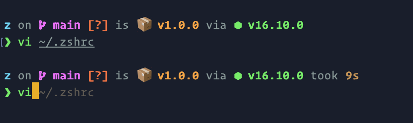

## bat

[bat](https://github.com/sharkdp/bat) - 类似 cat(1)，但带有 git 集成和语法高亮。

<!--  -->
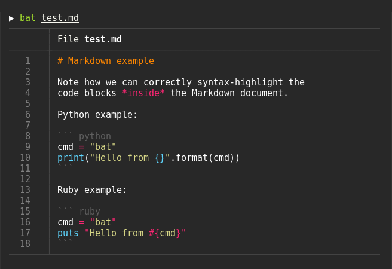

## fd

[fd](https://github.com/sharkdp/fd) - 是一种简单快速和用户友好的 `find` 替代方案。

<!--  -->
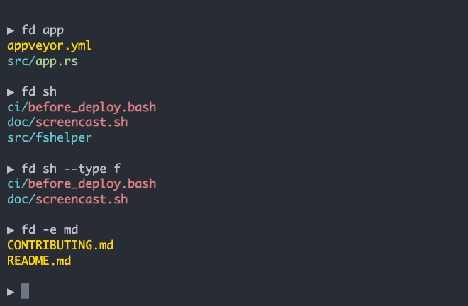

## git

### gh

[gh](https://cli.github.com) - GitHub CLI 或 gh 是 GitHub 的命令行界面，可在您的终端或脚本中使用。

<!--  -->
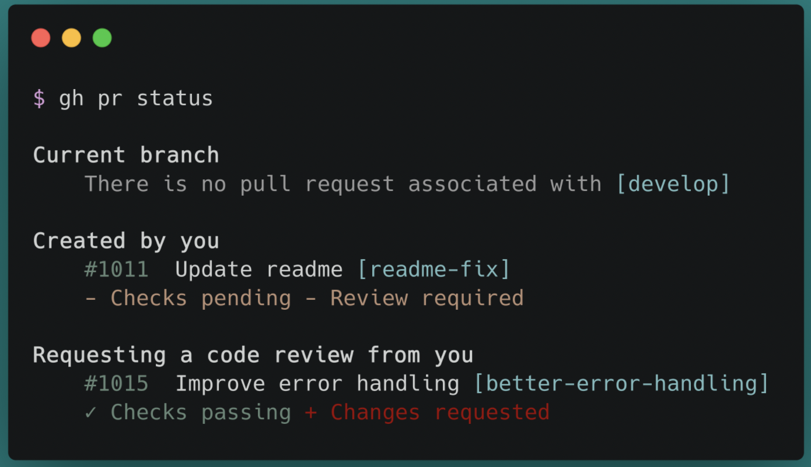

### gix

[gix](https://github.com/Byron/gitoxide) - gix 是用于访问 git 存储库的命令行界面 ( CLI )。它是为了优化用户体验而编写的，其性能与规范实现一样好或更好。此外，它以各种小型 `crate` 的形式提供了一个简单且安全的 API ，用于轻松实现自己的工具。

### dura

[dura](https://github.com/tkellogg/dura) - Dura 是一个后台进程，它监视您的 Git 存储库并提交您未提交的更改，而不会影响 HEAD、当前分支或 Git 索引（暂存文件）。如果您遇到异常导致工作内容丢失，进入 dura 分支可以恢复。如果没有 dura，可以在编辑器中使用 `Ctrl-Z` 来恢复状态。2021 年就是这样。计算机崩溃，`Ctrl-Z` 只能独立处理文件。Dura 快照随时更改整个存储库，因此可以恢复到“4 小时前”而不是“按 Ctrl-Z 40 次或其他”。

### delta

[delta](https://github.com/dandavison/delta) - 用于 `git`、`diff` 和 `grep` 输出的语法高亮分页器。

<!--  -->
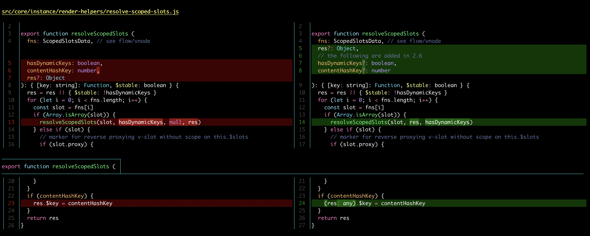

### tig

[tig](https://github.com/jonas/tig) - Git 的文本模式界面。

<!--  -->
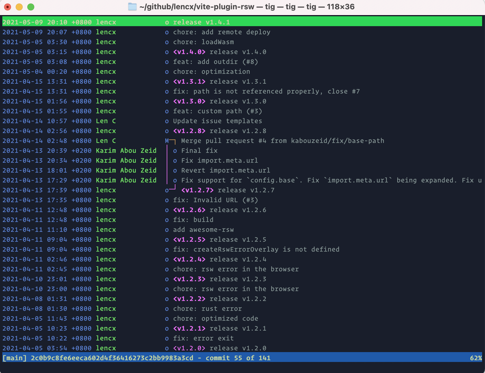

### git-journal

[git-journal](https://github.com/saschagrunert/git-journal) - Git 提交消息和变更日志生成框架。
<!--  -->
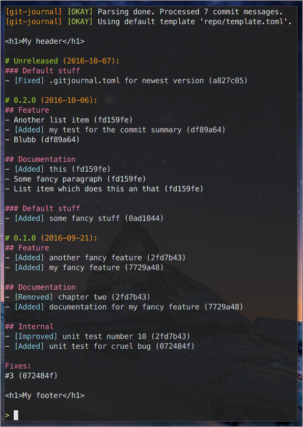

## ls

### exa

[exa](https://github.com/ogham/exa) - 是 `ls` 的现代替代品。

<!--  -->
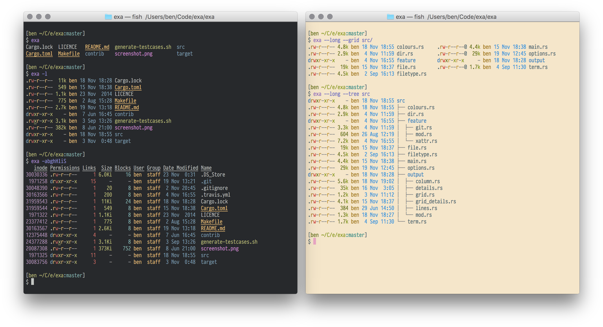

### lsd

[lsd](https://github.com/Peltoche/lsd) - 下一代 `ls` 命令。

<!--  -->
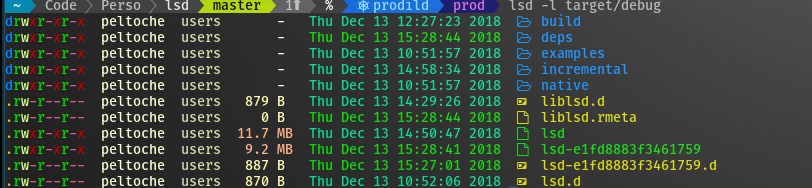

### nat

[nat](https://github.com/willdoescode/nat) - 具有有用信息和色彩的 `ls` 替代品。

<!--  -->
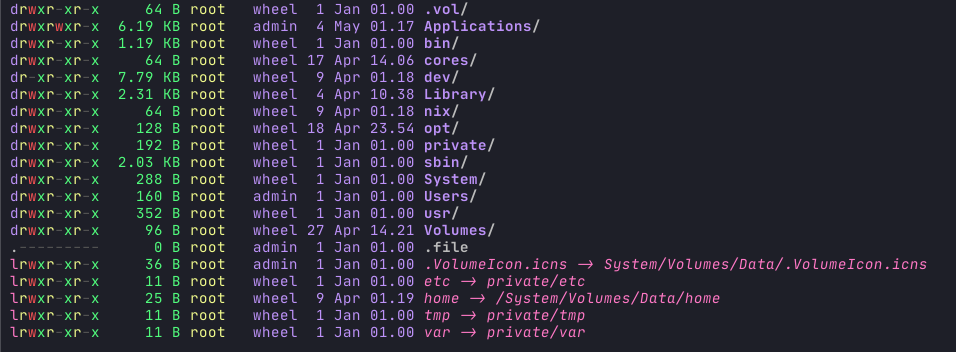

## just

[just](https://github.com/casey/just) - 是保存和运行项目的特定命令的简便方法，其语法受 `make` 启发。

<!--  -->
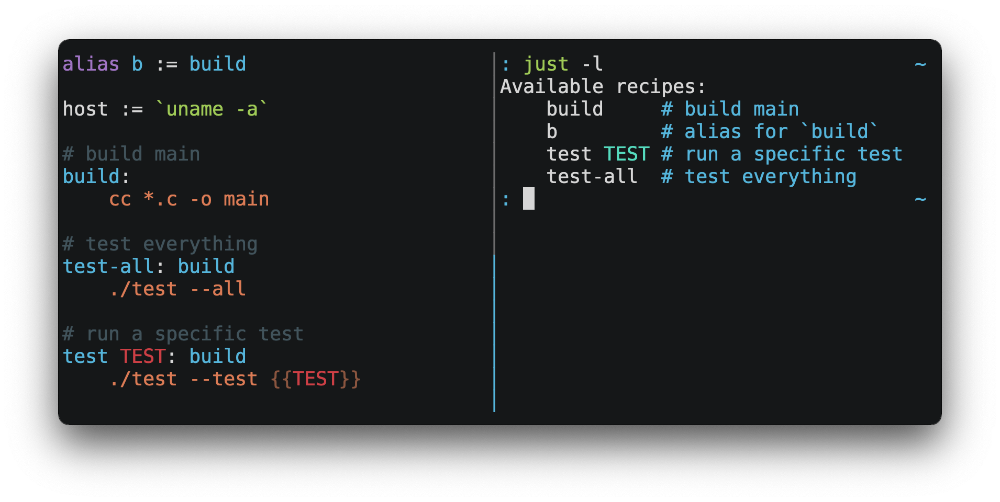

## Asciinema

[asciinema](https://asciinema.org/) - 是一个免费的开源的轻量级、纯文本终端录制方法。以正确的方式记录和分享您的终端会话。

<!--  -->
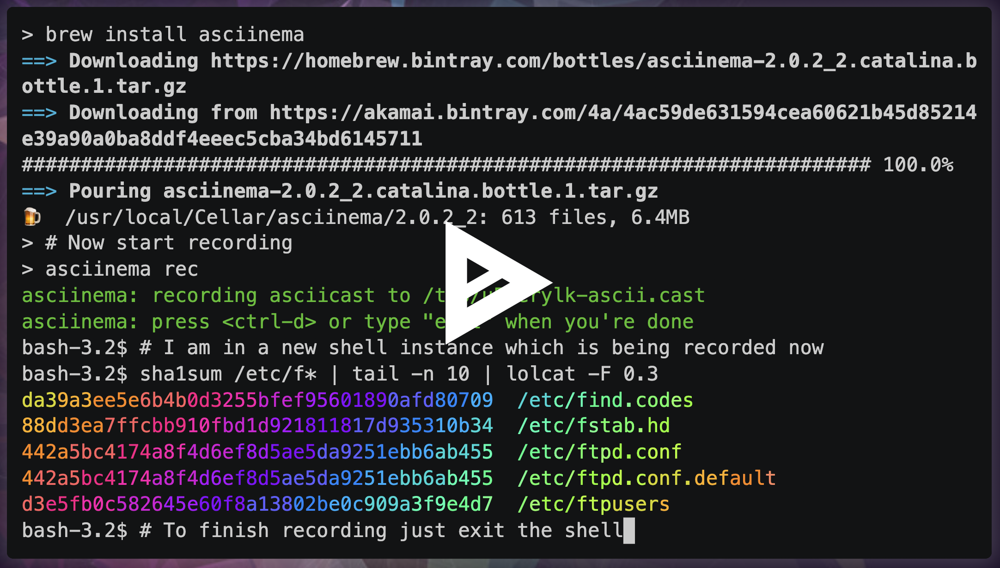

## fff

[fff](https://github.com/dylanaraps/fff) - 用 bash 编写的简单文件管理器。

<!--  -->
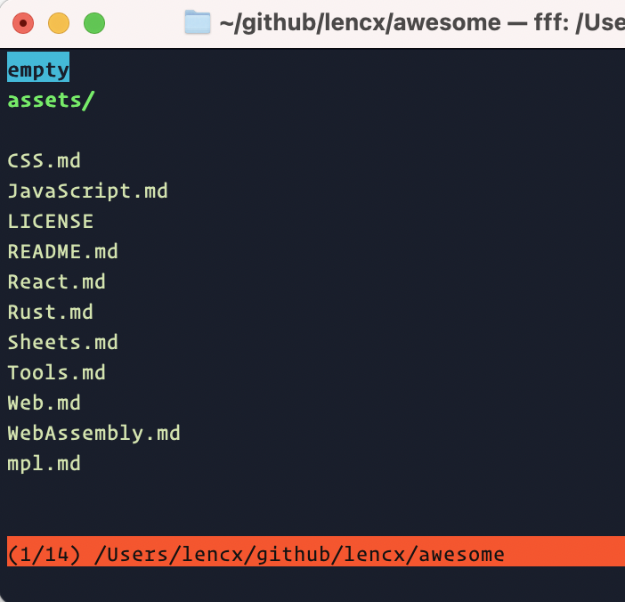

## Watchexec

[watchexec](https://github.com/watchexec/watchexec) 是一个简单的独立工具，它监视路径并在检测到修改时运行命令。

<!--  -->
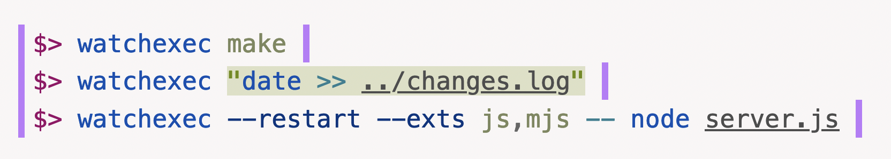

## Ripgrep

[ripgrep](https://github.com/BurntSushi/ripgrep) - 是一种面向行的搜索工具，它递归地在当前目录中搜索正则表达式模式。默认情况下，ripgrep 将遵守 gitignore 规则并自动跳过隐藏文件/目录和二进制文件。

<!--  -->
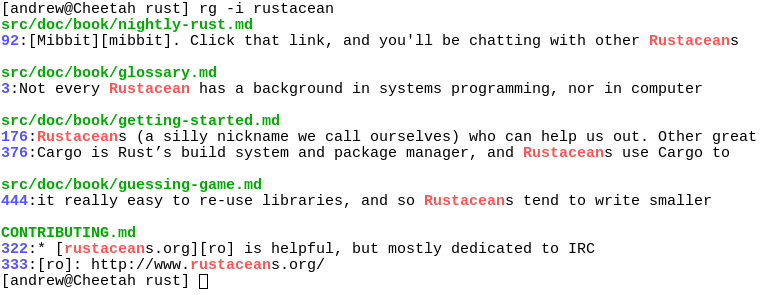

## Hexyl

[hexyl](https://github.com/sharkdp/hexyl) - 是一个简单的终端十六进制查看器。它使用彩色输出来区分不同类别的字节（NULL 字节、可打印的 ASCII 字符、ASCII 空白字符、其他 ASCII 字符和非 ASCII）。

<!--  -->
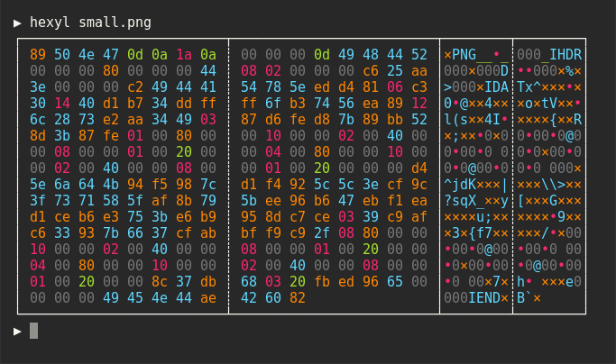

## Zellij

[zellij](https://github.com/zellij-org/zellij) - 是一个面向开发人员、面向运维的人员和任何喜欢终端的人的工作区。它的核心是一个终端多路复用器（类似于 [tmux](https://github.com/tmux/tmux) 和 [screen](https://www.gnu.org/software/screen/)），但这仅仅是它的基础设施层。

<!--  -->
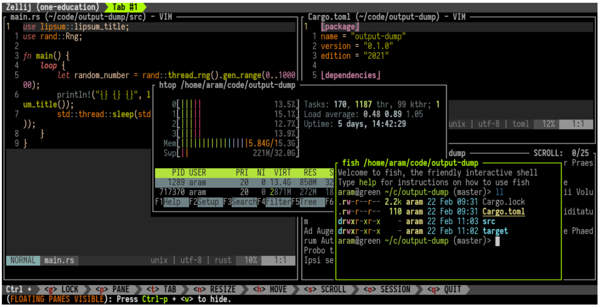

## Image

### cavif

[cavif](https://github.com/kornelski/cavif-rs) - AVIF 图像的编码器/转换器，纯 Rust 实现。

```bash
cavif --quality 60 image.png
```

### svgcleaner

[svgcleaner](https://github.com/RazrFalcon/svgcleaner) - 清理 SVG 文件中不必要的数据。

```bash
svgcleaner --indent=2 --paths-coordinates-precision=5 --join-arcto-flags=yes in.svg out.svg
```

## CSV

### xsv

[xsv](https://github.com/BurntSushi/xsv) 是一个用于索引、切片、分析、拆分和连接 CSV 文件的命令行程序。

```bash
$ xsv stats worldcitiespop.csv --everything | xsv table
field       type     min            max            min_length  max_length  mean          stddev         median     mode         cardinality
Country     Unicode  ad             zw             2           2                                                   cn           234
City        Unicode   bab el ahmar  Þykkvibaer     1           91                                                  san jose     2351892
AccentCity  Unicode   Bâb el Ahmar  ïn Bou Chella  1           91                                                  San Antonio  2375760
Region      Unicode  00             Z9             0           2                                        13         04           397
Population  Integer  7              31480498       0           8           47719.570634  302885.559204  10779                   28754
Latitude    Float    -54.933333     82.483333      1           12          27.188166     21.952614      32.497222  51.15        1038349
Longitude   Float    -179.983333    180            1           14          37.08886      63.22301       35.28      23.8         1167162
```

### csview

[csview](https://github.com/wfxr/csview) - 带有 [cjk](https://en.wikipedia.org/wiki/CJK_characters)/emoji 支持的 cli 的漂亮 csv 查看器。

<!--  -->
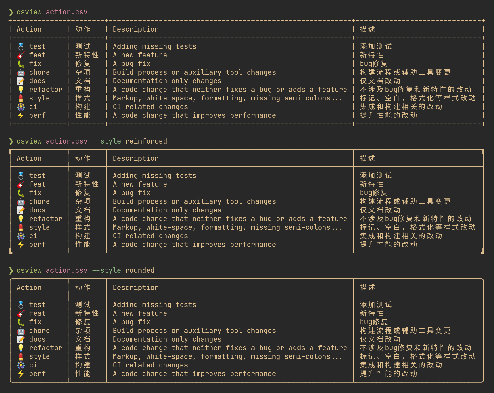

## Tokei

[tokei](https://github.com/XAMPPRocky/tokei) - 是一个显示代码统计信息的程序。 Tokei 将显示文件数、这些文件中的总行数以及按语言分组的代码、注释和空白。

```bash
===============================================================================
 Language            Files        Lines         Code     Comments       Blanks
===============================================================================
 BASH                    4           49           30           10            9
 JSON                    1         1332         1332            0            0
 Shell                   1           49           38            1           10
 TOML                    2           77           64            4            9
-------------------------------------------------------------------------------
 Markdown                5         1355            0         1074          281
 |- JSON                 1           41           41            0            0
 |- Rust                 2           53           42            6            5
 |- Shell                1           22           18            0            4
 (Total)                           1471          101         1080          290
-------------------------------------------------------------------------------
 Rust                   19         3416         2840          116          460
 |- Markdown            12          351            5          295           51
 (Total)                           3767         2845          411          511
===============================================================================
 Total                  32         6745         4410         1506          829
===============================================================================
```

## procs

[procs](https://github.com/dalance/procs) - 是用 Rust 编写的 [ps](https://man7.org/linux/man-pages/man1/ps.1.html) 的替代品。

<!--  -->
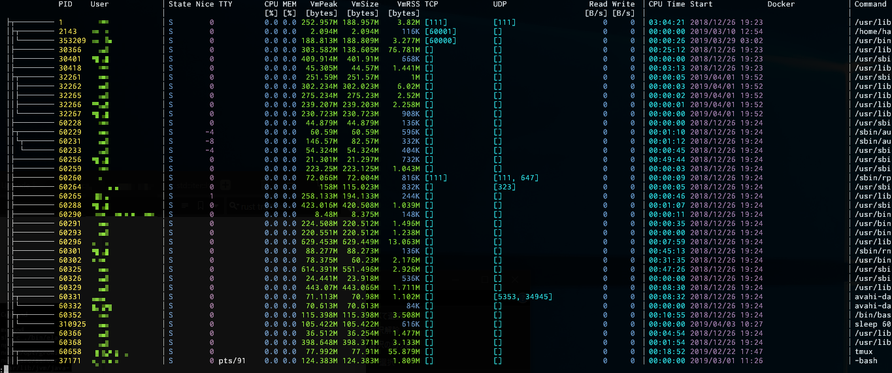

## eva

[eva](https://github.com/nerdypepper/eva) - 简单的计算器 REPL，类似于 bc(1)，具有语法高亮和持久历史记录。

<!--  -->
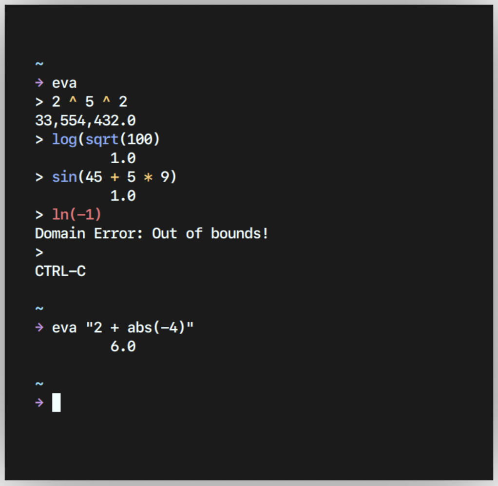

## hyperfine

[hyperfine](https://github.com/sharkdp/hyperfine) - 命令行基准测试工具。

<!--  -->


## ffsend

[ffsend](https://gitlab.com/timvisee/ffsend) - 从命令行轻松安全地共享文件。 一个功能齐全的 Firefox Send 客户端。

<!--  -->
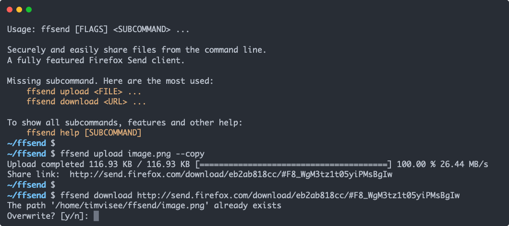

## alacritty

[alacritty](https://github.com/alacritty/alacritty) - 是一个现代终端仿真器，具有合理的默认值，但允许进行广泛的配置。 通过与其他应用程序集成，而不是重新实现它们的功能，它设法提供了一组灵活的高性能特性。 目前支持的平台包括 BSD、Linux、macOS 和 Windows。

<!--  -->
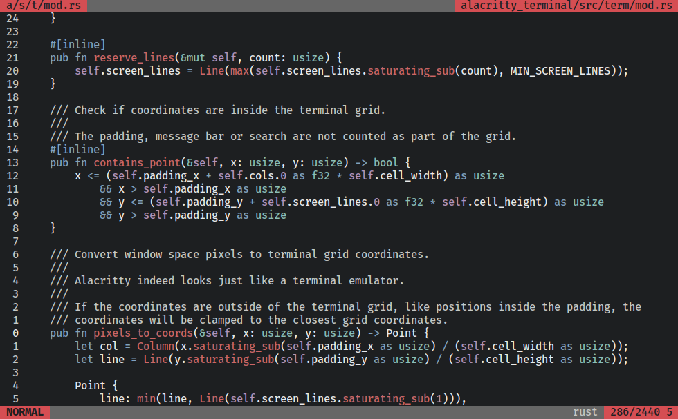

## Node.js

### nvm

[nvm](https://github.com/nvm-sh/nvm) - 允许您通过命令行快速安装和使用不同版本的 `Node.js`。

<!--  -->
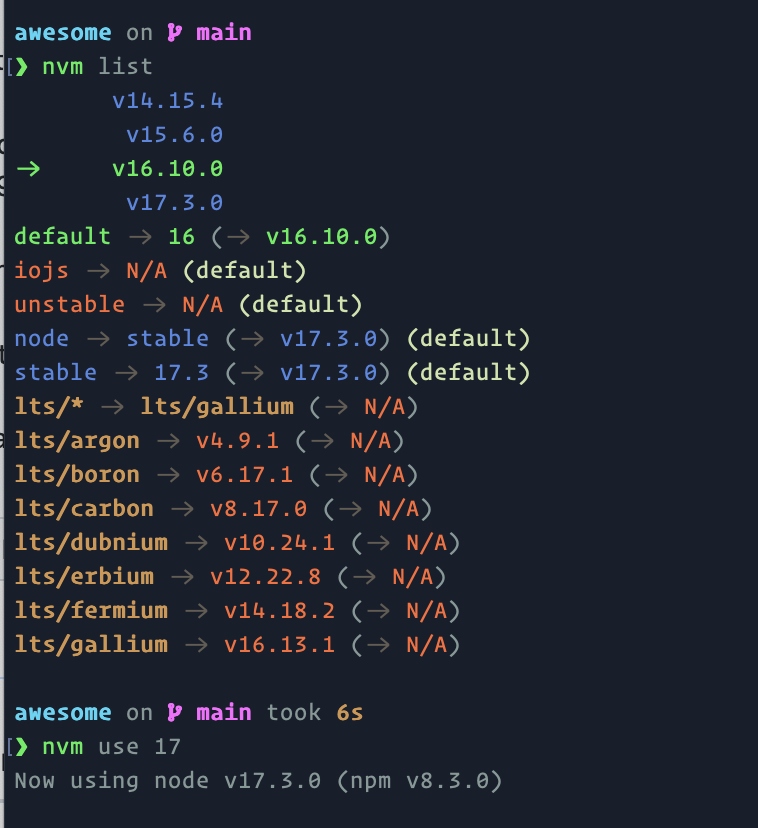

### fnm

[fnm](https://github.com/Schniz/fnm) - 快速简单的 `Node.js` 版本管理器，基于 Rust 实现。

<!--  -->
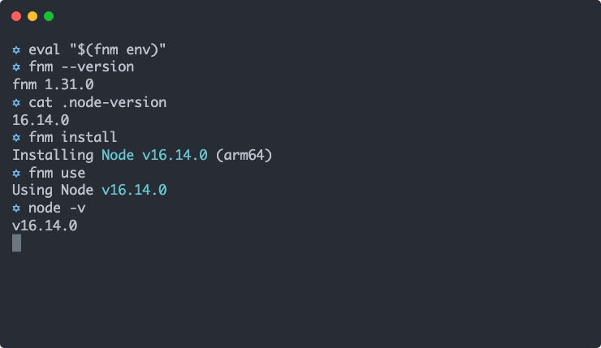

### volta

[Volta](https://github.com/volta-cli/volta) - 快速无缝地安装和运行任何 JS 工具！ Volta 是用 Rust 构建的，以二进制文件形式发布，跨平台支持（macOS、Windows、Linux）。

<!--  -->

